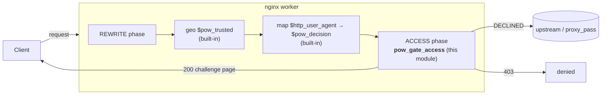
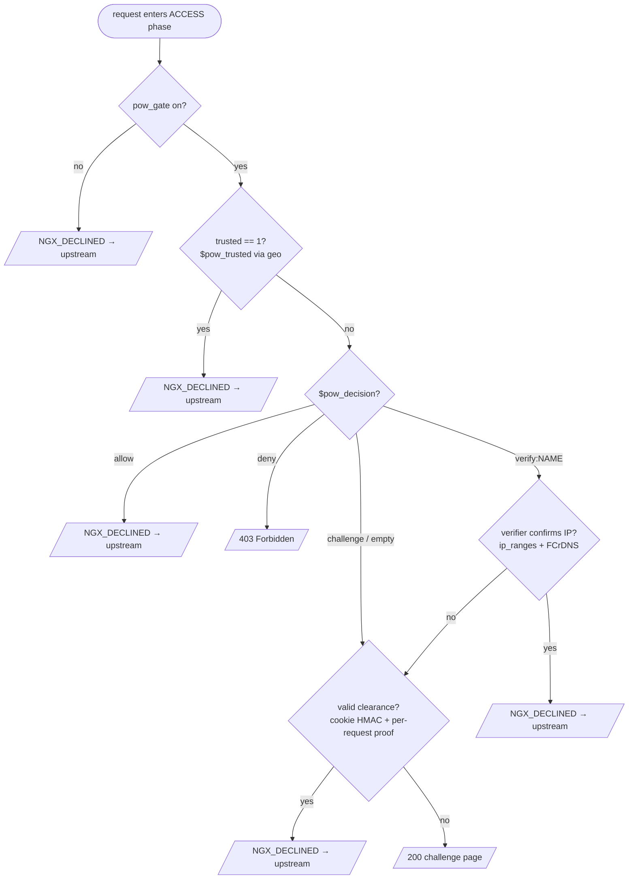
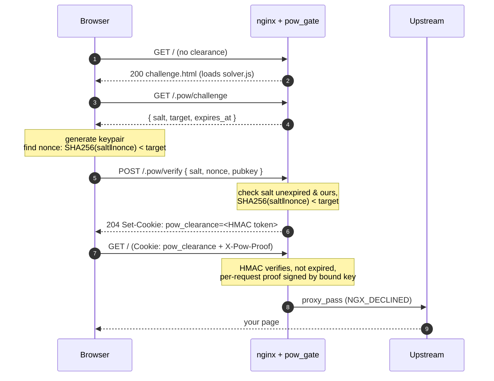

# ngx_http_pow_gate_module

[](https://github.com/teian/ngx_http_pow_gate/actions/workflows/ci.yml)
[](https://github.com/teian/ngx_http_pow_gate/actions/workflows/module-amd64.yml)
[](https://github.com/teian/ngx_http_pow_gate/actions/workflows/module-arm64.yml)

A native **nginx dynamic module** that puts a **proof-of-work (PoW) gate** in front
of your sites to deter scrapers, AI crawlers, and abusive bots — while letting
real browsers, trusted networks, and *verified* good bots through with no friction.

It is written in Rust against [`ngx`](https://github.com/nginxinc/ngx-rust) (the
official nginx-rust bindings) and plugs into nginx's **ACCESS phase**. Crucially,
it does **not** reinvent matching: trusted networks come from the built-in `geo`
module, and per–User-Agent decisions come from the built-in `map` module. The
module only adds what stock nginx can't do: issuing/verifying proof-of-work,
clearance cookies, and a *verified good-bot* allowlist (official IP ranges + FCrDNS).

> **Status:** functional end-to-end, no scaffold left. The engine
> (`src/pow-gate-core`) is **unit-tested** (31 tests), the solver is real, and the
> module **compiles against nginx 1.31.1, loads, and passes a full live handshake**
> (challenge → solve → verify → cleared) plus the **good-bot verifier** — all four
> Docker pipeline stages green ([docs/testing.md](docs/testing.md)). See
> [What's implemented](#whats-implemented).

---

## Table of contents

- [Why a PoW gate](#why-a-pow-gate)
- [How it works (at a glance)](#how-it-works-at-a-glance)
- [Request decision flow](#request-decision-flow)
- [The challenge / solve / verify handshake](#the-challenge--solve--verify-handshake)
- [Quickstart](#quickstart)
- [Configuration](#configuration)
- [Project layout](#project-layout)
- [Building](#building)
- [Performance](#performance)
- [What's implemented](#whats-implemented)
- [Documentation](#documentation)

---

## Why a PoW gate

A proof-of-work gate makes every un-trusted client spend a small amount of CPU
**before** it reaches your upstream. For a human loading a page once, that's a
few hundred milliseconds, invisible behind a "Just a moment…" screen. For a
scraper hitting thousands of URLs, that cost multiplies into something that
actually hurts — without IP blocklists, CAPTCHAs, or a third-party service.

The gate is layered so most traffic never pays:

| Client                                   | Outcome                                |
| ---------------------------------------- | -------------------------------------- |
| Trusted network (your LAN, your LB)      | pass — `geo` match                     |
| Verified good bot (Googlebot, Bingbot…)  | pass — IP-range + FCrDNS check         |
| Known-abusive UA (GPTBot, Bytespider…)   | `403` — `map` → `deny`                 |
| Already-cleared browser (valid cookie)   | pass — clearance cookie + proof        |
| Everyone else                            | **challenge** — solve PoW, then pass   |

---

## How it works (at a glance)



The module reads the results of the native `geo`/`map` engines as the variables
`$pow_trusted` and `$pow_decision`, then makes the final call in the ACCESS phase.
`NGX_DECLINED` means "I have no objection" → nginx continues to your upstream.

---

## Request decision flow

This is the exact branch logic in [`src/access.rs`](src/ngx-http-pow-gate/src/access.rs) — first match wins:



---

## The challenge / solve / verify handshake

When a client is challenged, it gets an HTML page that loads the solver. The
solver talks to three internal routes the module owns under `pow_gate_endpoint`
(default `/.pow/`):



Two tokens, two jobs:

- **Clearance cookie** (`pow_gate_clearance_ttl`, default 12h) — proves the client
  *did the work*. HMAC-signed with your server key; bound to a client keypair.
  Long-lived on purpose: a human solves once, then browses for the day without
  being re-challenged.
- **Per-request proof** (`pow_gate_proof_skew`, e.g. 5s) — a DPoP-style signature
  proving it's *the same client, this request, right now*. Defeats cookie theft
  and replay. A stolen cookie is useless without the private key.

See [docs/protocol.md](docs/protocol.md) for token formats and endpoint contracts,
and [docs/architecture.md](docs/architecture.md) for the threat model.

---

## Quickstart

```nginx
load_module modules/ngx_http_pow_gate_module.so;

http {
    pow_gate_hmac_key_file /etc/pow/hmac.key;   # the one server secret
    pow_gate_difficulty    50000;               # ~expected hashes per solve

    geo $pow_trusted {                          # built-in nginx module
        default        0;
        10.0.0.0/8     1;
    }

    map $http_user_agent $pow_decision {        # built-in nginx module
        default                       challenge;
        ~*(gptbot|ccbot|bytespider)   deny;
        ~*(googlebot|bingbot)         verify:search_engines;
    }

    server {
        location / {
            pow_gate          on;
            pow_gate_trusted  $pow_trusted;
            pow_gate_decision $pow_decision;
            proxy_pass http://backend;
        }

        # exclusions are just locations with the gate off — no new syntax
        location = /robots.txt { pow_gate off; proxy_pass http://backend; }
    }
}
```

A complete, commented example — including a `pow_gate_verifier` block and path
exclusions — is in [examples/nginx.conf](examples/nginx.conf).

---

## Configuration

Every directive at a glance. Full reference (contexts, defaults, edge cases) in
[docs/configuration.md](docs/configuration.md).

| Directive                  | Context              | Arg            | Purpose                                            |
| -------------------------- | -------------------- | -------------- | -------------------------------------------------- |
| `pow_gate`                 | http, server, location    | `on`\|`off`    | Enable/disable the gate (inheritable flag)         |
| `pow_gate_trusted`         | server, location          | `$var`         | Non-`0` ⇒ allow, skip the gate (usually `geo`)     |
| `pow_gate_decision`        | server, location          | `$var`         | `allow`\|`deny`\|`challenge`\|`verify:<name>`       |
| `pow_gate_page`            | http, server, location    | `<file>`       | Custom challenge page (templated; default embedded) |
| `pow_gate_difficulty`      | http, server, location    | `N`            | Expected hash count per solve                      |
| `pow_gate_hmac_key_file`   | http, server, location    | `<file>`       | Server secret for clearance/proof signing          |
| `pow_gate_clearance_ttl`   | http, server, location    | `<time>`       | How long a clearance lasts (default `12h`)         |
| `pow_gate_proof_skew`      | http, server, location    | `<time>`       | Per-request proof validity window (e.g. `5s`)      |
| `pow_gate_endpoint`        | http, server, location    | `<prefix>`     | Internal route prefix (default `/.pow/`)           |
| `pow_gate_cookie_name`     | http, server, location    | `<name>`       | Clearance cookie name (default `pow_clearance`)    |
| `pow_gate_cookie_domain`   | http, server, location    | `<domain>`     | Cookie `Domain=` (default host-only)               |
| `pow_gate_cookie_path`     | http, server, location    | `<path>`       | Cookie `Path=` (default `/`)                       |
| `pow_gate_cookie_samesite` | http, server, location    | `Lax\|Strict\|None` | Cookie `SameSite=` (default `Lax`)            |
| `pow_gate_cookie_secure`   | http, server, location    | `on`\|`off`    | Cookie `Secure` flag (default `on`)                |
| `pow_gate_cookie_httponly` | http, server, location    | `on`\|`off`    | Cookie `HttpOnly` flag (default `on`)              |
| `pow_gate_verifier <name>` | http (block)         | `{ … }`        | Verified good-bot allowlist (IP ranges + FCrDNS)   |

Every directive except the `pow_gate_verifier` block **inherits** `http → server
→ location` and can be overridden at any level — set the tunables once high up,
flip exceptions low down. The verifier block is `http`-only because it registers
a global named allowlist used by `verify:<name>` from anywhere.

The decision values understood by `pow_gate_decision`:

- `allow` — let it through.
- `deny` — `403`, no challenge.
- `challenge` — must solve PoW (the default for unknown clients).
- `verify:<name>` — run the named `pow_gate_verifier`; pass only if it confirms
  the connecting IP really belongs to that bot.

---

## Project layout

A **virtual workspace**: the root `Cargo.toml` is only workspace glue; every crate
lives under `src/` with its own `src/` (and `tests/`).

```text
ngx_pow/
├── Cargo.toml                     [workspace] only (not a package)
├── src/
│   ├── ngx-http-pow-gate/         the nginx dynamic module (cdylib)
│   │   ├── Cargo.toml  build.rs   nginx link glue + asset rebuild triggers
│   │   └── src/
│   │       ├── lib.rs             module registration: ngx_module_t, ctx, ngx_modules!
│   │       ├── config.rs          directives, MainConf/LocationConf, create + merge
│   │       ├── access.rs          ACCESS-phase handler — allow/deny/challenge decision
│   │       ├── challenge.rs       challenge-page + internal /.pow/ endpoints
│   │       ├── verifier.rs        pow_gate_verifier {} — good-bot allowlist
│   │       └── engine/            thin nginx shell over the core (FFI seam)
│   └── pow-gate-core/             the engine — NO nginx dep, unit-tested
│       ├── Cargo.toml
│       ├── src/     target · codec · mac · pow · clearance · proof
│       ├── tests/   one test crate per concern (their own projects)
│       └── benches/ Criterion microbenchmarks (engine hot path)
├── tests/integration/            black-box e2e client (standalone project)
├── perf/                         HTTP load generator (standalone project)
├── assets/
│   ├── challenge.html             embedded fallback page (themed, i18n)
│   └── solver.js                  browser solver (keygen, PoW loop, verify, proof)
├── docker/                       Dockerfile (multi-stage) + nginx.test.conf
├── docker-compose.test.yml       live e2e   ·  docker-compose.perf.yml  load test
├── examples/nginx.conf           full commented configuration example
├── scripts/                      test.sh (pipeline) · perf.sh (load test)
└── docs/  architecture · configuration · build · protocol · challenge-page · testing · performance
```

The cryptography lives in **`src/pow-gate-core`** (no nginx dependency, so it
unit-tests anywhere); **`src/ngx-http-pow-gate`** is a thin FFI shell that reads
the request and calls into it. See [docs/testing.md](docs/testing.md).

---

## Building

```bash
# build against a CONFIGURED nginx source tree (./configure first — see below)
export NGINX_SOURCE_DIR=/path/to/nginx-1.31.1
cargo build --release -p ngx-http-pow-gate

# the artifact, renamed to the name used in load_module:
cp target/release/libngx_http_pow_gate.so \
   /etc/nginx/modules/ngx_http_pow_gate_module.so
```

> **ABI warning:** a dynamic module must be built against the **same nginx
> version and `./configure` arguments** as the nginx that loads it, or nginx
> refuses it (`module ... is not binary compatible`). Check `nginx -V`.

Full instructions (toolchain, env vars, Docker build, matching `nginx -V`,
troubleshooting) are in [docs/build.md](docs/build.md).

---

## Performance

Measured by the load suite (`./scripts/perf.sh`) against the module in nginx, and
by engine microbenchmarks (`cargo bench -p pow-gate-core`). Numbers are from one
small box — **the ratios are the point, not the absolutes**; full method and
analysis in [docs/performance.md](docs/performance.md).

**Per-request HTTP cost** (8 connections, 4 request classes):

| Request class                         | req/s  | p50    | vs. baseline      |
| ------------------------------------- | ------ | ------ | ----------------- |
| `baseline` — gate off (ungated)       | 19420  | 411 µs | —                 |
| `cleared` — clearance cookie, no proof| 17339  | 459 µs | **~0.9× (≈free)** |
| `challenge` — serve the challenge page| 9465   | 796 µs | one-time/visitor  |
| `proof` — cookie + `X-Pow-Proof`      | 2925   | 2.7 ms | **~6× slower**    |

**Engine microbenchmarks** (per-op):

| Operation                  | Cost     |
| -------------------------- | -------- |
| `clearance_verify` (HMAC)  | ~2.3 µs  |
| `pow_verify_solution`      | ~2.0 µs  |
| **`proof_verify` (ECDSA P-256)** | **~255 µs** |

**Takeaways:**

- **Cookie-only gating is essentially free** — a cleared request (the steady
  state for top-level navigations) is within noise of ungated nginx.
- **The per-request ECDSA proof is the bottleneck** — ~100× the HMAC cookie check,
  capping throughput to roughly *cores × 4000 req/s* when present on every request.
  It is *opt-in* hardening for `fetch`/XHR (navigations can't send the header), so
  most page-view traffic never pays it. Mitigations (sampling, more cores) are in
  [docs/performance.md](docs/performance.md).

---

## What's implemented

The module is **functional end-to-end** — every feature below is exercised by the
Docker pipeline ([docs/testing.md](docs/testing.md)), so this is reproducible, not
a claim. There is no scaffold left.

**Pipeline — all green:** core tests ✅ · module-build (glibc + musl, amd64 + arm64) ✅ · nginx-smoke (`nginx -t`, every libc×arch) ✅ · **e2e ✅**

| Area | Evidence |
| ---- | -------- |
| Crypto engine — PoW, clearance, ECDSA proof, IP-ranges (`src/pow-gate-core`) | **32 unit tests** green (`cargo test -p pow-gate-core`) |
| Browser solver (`assets/solver.js`) | real WebCrypto keygen + 256-bit PoW + proof + IndexedDB |
| Challenge page (`assets/challenge.html`) | themed (light/dark) + i18n (26 languages) |
| Directives, config structs, inheritance merge | compiles + `nginx -t` passes |
| Module builds against nginx 1.31.1 & loads (glibc + musl, amd64 + arm64) | module-build + nginx-smoke green for every libc×arch |
| ACCESS handler + phase registration | handler runs (registered in `postconfiguration`) |
| `/.pow/` endpoints — challenge JSON, solver, **async `POST /verify` body** | served correctly in the live test |
| Response I/O — challenge page, JSON, `Set-Cookie`, `204` | written via the `ngx` output chain |
| Clearance cookie + per-request proof validation | cookie + `X-Pow-Proof` checked against the cookie-bound key |
| Full handshake: challenge → solve → verify → cleared | e2e stage green |
| **Good-bot verifier** — `pow_gate_verifier {}` block, IP-range feed fetch + refresh, CIDR match, FCrDNS, client-IP parse | **e2e: a `verify:<name>` UA is allowed via the live IP-range feed** |

### Known limitations

- A `POST /verify` body larger than the client-body buffer (spilled to a temp
  file) isn't read — solver submissions are tiny, so this isn't hit in practice.
- FCrDNS resolves on a background thread and caches verdicts; the very first
  request for a new IP falls through to a challenge while DNS is in flight
  (fail-closed). The IP-range path has no such delay.

Only the verified-good-bot allowlist is unfinished. Until it lands, a
`verify:<name>` decision **fails closed** — it falls through to a normal challenge
rather than wrongly allowing — so it is safe to ship the gate without it.

---

## Documentation

- **[docs/architecture.md](docs/architecture.md)** — phase integration, full
  request lifecycle, the two-token security model, threat model.
- **[docs/configuration.md](docs/configuration.md)** — every directive: context,
  arguments, defaults, inheritance, and worked recipes.
- **[docs/build.md](docs/build.md)** — toolchain, building against your nginx,
  ABI matching, Docker, install, reload, troubleshooting.
- **[docs/protocol.md](docs/protocol.md)** — the `/.pow/` endpoints, challenge
  and token formats, and the client/server message contract.
- **[docs/challenge-page.md](docs/challenge-page.md)** — customizing the
  "Just a moment…" page: the hook contract, placeholders, a minimal template, and
  the built-in light/dark theme + i18n (26 languages, auto-detected).
- **[docs/testing.md](docs/testing.md)** — the self-verifying Docker pipeline
  (engine tests → build → `nginx -t` → live e2e handshake).
- **[docs/performance.md](docs/performance.md)** — per-request cost,
  microbenchmarks, the HTTP load suite, and the ECDSA-proof bottleneck.

---

## License

BSD 2-Clause — see [LICENSE](LICENSE). © 2026 Frank Gehann.
