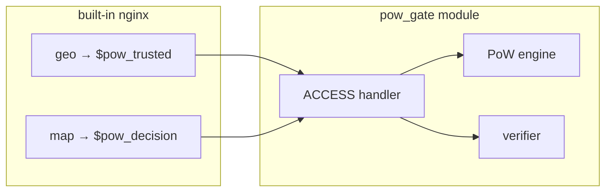
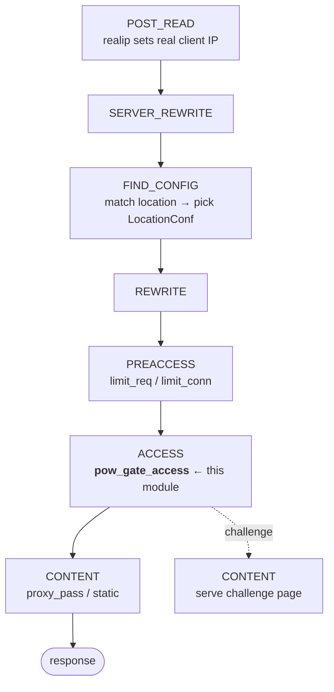
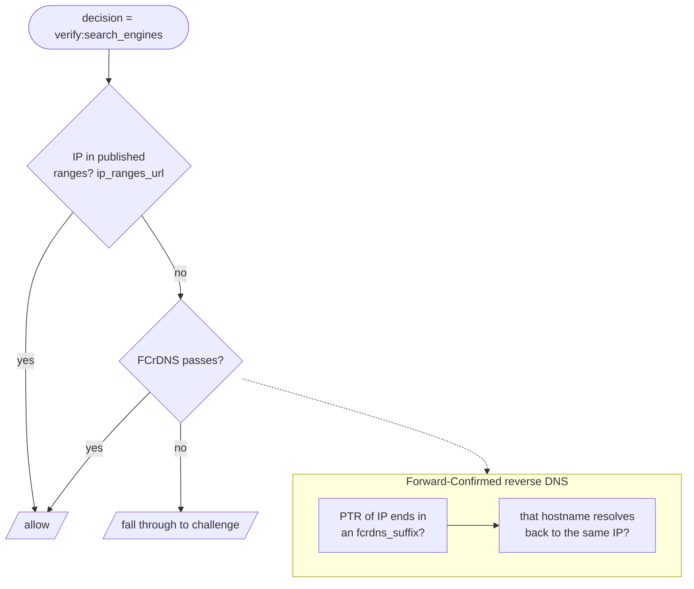

# Architecture

How the module fits into nginx, what happens to a request from socket to
upstream, and the security model behind the two tokens.

- [Design principle: lean on nginx](#design-principle-lean-on-nginx)
- [Where the module sits in the nginx pipeline](#where-the-module-sits-in-the-nginx-pipeline)
- [Configuration-time wiring](#configuration-time-wiring)
- [Request lifecycle](#request-lifecycle)
- [The two-token security model](#the-two-token-security-model)
- [Verified good-bot allowlist](#verified-good-bot-allowlist)
- [Threat model](#threat-model)
- [Source map](#source-map)

---

## Design principle: lean on nginx

The module deliberately does **not** implement IP matching or User-Agent
classification. nginx already has fast, battle-tested engines for both:

- **`geo`** maps the client address to a value → exposed as `$pow_trusted`.
- **`map`** maps `$http_user_agent` (or anything) to a value → `$pow_decision`.

The module consumes those variables and only owns the parts nginx can't express:
proof-of-work issuance/verification, the clearance/proof tokens, and a
good-bot verifier. This keeps the configuration idiomatic — operators compose
the gate with tools they already know, and *path exclusions are just a
`location` with `pow_gate off;`* rather than a bespoke match syntax.



---

## Where the module sits in the nginx pipeline

nginx processes each request through ordered **phases**. The gate installs one
handler on the **ACCESS phase** (the same phase `allow`/`deny` and `auth_request`
use), which runs *after* rewrite and *before* content generation — exactly where
an accept/reject decision belongs.



Why ACCESS:

- It sees the **matched location**, so per-location `pow_gate on|off` and
  `pow_gate_decision` are already resolved.
- Returning `NGX_DECLINED` means "no objection, continue" — other ACCESS
  handlers (e.g. `allow`/`deny`) still run. Returning `403`/serving the page
  short-circuits.
- `realip` has already run in POST_READ, so `$remote_addr` is the true client
  when behind a load balancer (provided you configured `set_real_ip_from`).

---

## Configuration-time wiring

Before any request is served, nginx builds the config tree and calls the module's
HTTP context callbacks (defined in [`src/lib.rs`](../src/ngx-http-pow-gate/src/lib.rs)):

```mermaid
sequenceDiagram
    participant Ng as nginx (config load)
    participant Mod as pow_gate module

    Ng->>Mod: create_main_conf()      %% MainConf = just the verifier registry
    Ng->>Mod: create_location_conf()  (per location)  %% all tunables + UNSET sentinels
    Note over Ng,Mod: parse directives via the command table<br/>(set_flag/str/num/sec/complex_value slots)
    Ng->>Mod: pow_gate_verifier { } block handler  %% build named Verifier (global)
    Ng->>Mod: merge_location_conf(parent, child)  (per location)
    Note over Mod: inheritance http→server→location for<br/>every knob; pow_gate off wins locally;<br/>load+cache challenge page once
    Ng->>Mod: postconfiguration()     %% install pow_gate_access on ACCESS phase
    Note over Ng: worker fork
    Ng->>Mod: init_process()  (per worker)  %% load HMAC key(s), start range refreshers
```

Key points:

- **`create_*`** zero the structs (via `ngx_pcalloc`) and mark numeric/pointer
  fields with `NGX_CONF_UNSET*` so `merge_*` can tell "not set here" from
  "explicitly set". This is what makes inheritance work.
- **Almost every directive lives in `LocationConf`**, so it is valid in
  `http`/`server`/`location` and inherits downward (set once high, override low) —
  the same model as `proxy_*`. `MainConf` holds *only* the global verifier
  registry. `merge_location_conf` resolves every knob with its documented default.
- **`merge_location_conf`** is where `pow_gate off;` in a child location overrides a
  parent `pow_gate on;` — plain nginx flag inheritance, no special code.
- The **challenge page is loaded and cached once** at merge time, not per
  request.
- **`postconfiguration`** is the only place the handler can be registered,
  because the phase arrays don't exist until the whole HTTP block is parsed.

---

## Request lifecycle

The full path for an un-trusted browser, from first hit to cleared:

```mermaid
sequenceDiagram
    autonumber
    participant B as Browser
    participant A as ACCESS handler
    participant E as PoW engine
    participant U as Upstream

    rect rgb(245,245,245)
    note over B,A: first visit — no cookie
    B->>A: GET /
    A->>A: enabled? trusted? decision?
    A->>A: has_valid_clearance() → false
    A-->>B: 200 challenge.html
    end

    rect rgb(245,245,245)
    note over B,E: solve loop (in solver.js)
    B->>E: GET /.pow/challenge
    E-->>B: { salt, target, expires_at }
    B->>B: keypair; find nonce: H(salt‖nonce) < target
    B->>E: POST /.pow/verify { salt, nonce, pubkey }
    E->>E: salt ours & unexpired? hash < target?
    E-->>B: 204 Set-Cookie: pow_clearance
    end

    rect rgb(235,245,235)
    note over B,U: cleared
    B->>A: GET / (Cookie + X-Pow-Proof)
    A->>E: has_valid_clearance()
    E->>E: HMAC ok? not expired? proof signed & fresh?
    A->>U: NGX_DECLINED → proxy_pass
    U-->>B: page
    end
```

---

## The two-token security model

A single cookie is not enough: cookies get stolen, copied between machines, and
replayed. The gate splits "did the work" from "is still the same client":

```mermaid
flowchart TB
    subgraph cookie[Clearance cookie — long-lived, pow_gate_clearance_ttl]
      c1[payload: ip_bucket, ua_hash,<br/>pubkey_thumbprint, issued, expires]
      c2[HMAC-SHA256 with server key]
      c1 --> c2
    end
    subgraph proof[Per-request proof — short-lived, pow_gate_proof_skew]
      p1[sign H method | path | timestamp]
      p2[with the client's private key]
      p1 --> p2
    end
    cookie -. binds .-> proof
    note[A stolen cookie has the pubkey_thumbprint<br/>but not the private key → cannot mint proofs]
    proof --- note
```

- **Clearance cookie** — issued once per solve. HMAC-signed with
  `pow_gate_hmac_key_file`, so clients can't forge it. Carries the *thumbprint*
  of the client's public key. Lives `pow_gate_clearance_ttl` (default 12h).
- **Per-request proof** — the client signs `(method, path, timestamp)` with the
  matching **private** key on every gated request. The server checks the
  signature against the cookie's thumbprint and that the timestamp is within
  `pow_gate_proof_skew` (e.g. 5s). A captured cookie+proof can't be replayed
  seconds later, and the cookie alone is worthless without the private key.

This is the same idea as [DPoP (RFC 9449)](https://www.rfc-editor.org/rfc/rfc9449):
bind a bearer token to a key the holder must prove possession of.

Implementation: [`src/engine/clearance.rs`](../src/ngx-http-pow-gate/src/engine/clearance.rs),
[`src/pow-gate-core/src/proof.rs`](../src/pow-gate-core/src/proof.rs).

---

## Verified good-bot allowlist

`verify:<name>` exists because User-Agent strings are trivially spoofed. Anyone
can send `User-Agent: Googlebot`. A verifier confirms the *connecting IP* really
belongs to the bot before allowing it:



- **IP ranges** are fetched from the bot operators' official JSON feeds
  (`ip_ranges_url`) and refreshed on a timer (`ip_ranges_refresh`). The merged
  table is swapped in atomically (`arc_swap`) so lookups never lock.
- **FCrDNS** verdicts are cached (`fcrdns_ttl`) so the hot path never blocks on
  DNS. A spoofed UA from a non-matching IP simply falls through to the normal
  challenge — it is not outright denied, so a misconfigured-but-real client
  still has a path through.

Implementation: [`src/verifier.rs`](../src/ngx-http-pow-gate/src/verifier.rs).

---

## Threat model

| Attack                                   | Defense                                                            |
| ---------------------------------------- | ----------------------------------------------------------------- |
| Mass scraping by cost-sensitive bots     | PoW makes each un-cleared request cost CPU (`pow_gate_difficulty`) |
| Spoofed good-bot User-Agent              | `verify:<name>` checks IP ranges + FCrDNS, not the UA string       |
| Clearance cookie theft / sharing         | Per-request proof bound to a private key the thief doesn't have    |
| Cookie/proof replay                      | Proof timestamp must be within `pow_gate_proof_skew`               |
| Forged clearance cookie                  | HMAC-SHA256 with server-only `pow_gate_hmac_key_file`              |
| Precomputed / farmed-out PoW solutions   | `salt` is per-request, HMAC-bound, and `expires_at`-limited        |
| Abusive UA you want to hard-block        | `map … deny` → `403`, no challenge offered                         |

**Out of scope / caveats:**

- PoW raises *cost*, it does not make scraping impossible. A determined,
  well-funded adversary can still pay it. Tune `pow_gate_difficulty` to your
  threat, and keep rate-limiting (`limit_req`) in front.
- A real browser with JS disabled cannot solve the challenge. Keep genuine
  non-JS clients (feeds, monitoring) on excluded locations or `allow`.
- The HMAC key is a server secret. Protect `pow_gate_hmac_key_file` (mode `600`,
  not world-readable) and rotate it if leaked — rotation invalidates all
  outstanding clearances.

---

## Source map

| Concern                         | File                                            |
| ------------------------------- | ----------------------------------------------- |
| Module registration, phase hook | [`src/lib.rs`](../src/ngx-http-pow-gate/src/lib.rs)                    |
| Directives, config, merge       | [`src/config.rs`](../src/ngx-http-pow-gate/src/config.rs)             |
| The accept/reject decision      | [`src/access.rs`](../src/ngx-http-pow-gate/src/access.rs)             |
| Challenge page + `/.pow/` routes | [`src/challenge.rs`](../src/ngx-http-pow-gate/src/challenge.rs)        |
| Good-bot verifier               | [`src/verifier.rs`](../src/ngx-http-pow-gate/src/verifier.rs)         |
| Clearance cookie                | [`src/engine/clearance.rs`](../src/ngx-http-pow-gate/src/engine/clearance.rs) |
| Per-request proof               | [`src/pow-gate-core/src/proof.rs`](../src/pow-gate-core/src/proof.rs) |
| PoW challenge/verify math       | [`src/engine/pow.rs`](../src/ngx-http-pow-gate/src/engine/pow.rs)     |
| Browser solver                  | [`assets/solver.js`](../assets/solver.js)       |
