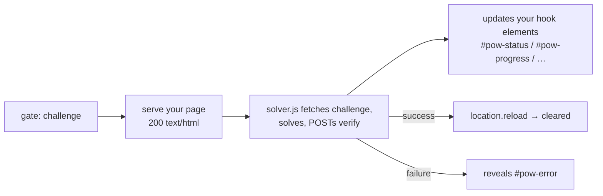

# Customizing the challenge page

The challenge page is the "Just a moment…" screen a client sees while it solves
the proof-of-work. **Everything about its look is yours** — markup, CSS, logo,
copy, animation. The module only needs a small, fixed *contract* so the solver
script can drive it. This page documents that contract and how to ship your own.

- [How the page is used](#how-the-page-is-used)
- [The contract (what the module requires)](#the-contract-what-the-module-requires)
- [Template placeholders](#template-placeholders)
- [The solver script tag](#the-solver-script-tag)
- [Minimal custom page](#minimal-custom-page)
- [Installing your page](#installing-your-page)
- [Embedded assets: page vs. solver](#embedded-assets-page-vs-solver)
- [Languages (i18n)](#languages-i18n)
- [Styling & branding freedom](#styling--branding-freedom)
- [Accessibility & no-JavaScript](#accessibility--no-javascript)
- [Testing it](#testing-it)
- [Common mistakes](#common-mistakes)

---

## How the page is used

When the gate decides a client must prove work, it serves this HTML (status
`200`) instead of proxying upstream. The page loads `solver.js`, which runs the
proof-of-work and, on success, reloads — the reloaded request carries the
clearance cookie and passes.



Your page never talks to the endpoints itself — `solver.js` does. Your only job
is to provide the hook elements it writes to, and to include the script tag.

---

## The contract (what the module requires)

Provide these element IDs. The solver reads/writes them by `id`; their tag and
styling are up to you.

| Element id      | Type the solver expects        | What the solver does                               |
| --------------- | ------------------------------ | -------------------------------------------------- |
| `pow-status`    | any text element               | Sets `.textContent` to status (`"Verifying…"`, `"Done"`) |
| `pow-progress`  | `<progress>` **or** any element | If it has `.value`, sets `0..100`; else sets `style.width = N%` |
| `pow-percent`   | any text element               | Sets `.textContent` to the integer percent         |
| `pow-error`     | any element (start hidden)     | Sets `style.display = "block"` on failure          |

All four are optional in the sense that the solver guards each lookup — a missing
id just means that piece of feedback isn't shown. But omitting `pow-error` hides
failures from the user, and omitting progress elements makes the wait opaque, so
include them unless you have a reason not to.

`pow-progress` is flexible on purpose:

```html
<progress id="pow-progress" max="100" value="0"></progress>   <!-- uses .value -->
<!-- or a plain bar you style yourself: -->
<div class="bar"><span id="pow-progress"></span></div>        <!-- uses style.width -->
```

---

## Template placeholders

Before the page is served, the module substitutes these tokens (text replace).
Use them so the page tracks your configuration automatically:

| Placeholder      | Replaced with                              | Source directive       |
| ---------------- | ------------------------------------------ | ---------------------- |
| `{{difficulty}}` | the configured expected-hash count         | `pow_gate_difficulty`  |
| `{{endpoint}}`   | the internal route prefix (e.g. `/.pow/`)  | `pow_gate_endpoint`    |

You normally only need them on the script tag (below). They are substituted once
at config-load time, when the page is cached.

---

## The solver script tag

This is the one piece of markup that is **not** optional. It loads the solver and
hands it the difficulty and endpoint via `data-` attributes:

```html
<script src="{{endpoint}}solver.js"
        data-difficulty="{{difficulty}}"
        data-endpoint="{{endpoint}}"
        defer></script>
```

- `src="{{endpoint}}solver.js"` — the module serves the solver at this route.
- `data-endpoint` — the solver uses it to find `challenge` / `verify`.
- `data-difficulty` — passed through for the solver's progress estimate.
- `defer` — let the DOM (your hook elements) exist before the solver runs.

Leave the `{{…}}` tokens literally in your file; the module fills them in.

---

## Minimal custom page

A complete, valid page can be tiny — just the hooks and the script:

```html
<!doctype html>
<html lang="en">
<head>
  <meta charset="utf-8">
  <meta name="viewport" content="width=device-width, initial-scale=1">
  <title>Checking your browser…</title>
</head>
<body>
  <main role="status" aria-live="polite">
    <h1>Just a moment…</h1>
    <p>Your browser is completing a quick automatic check.</p>

    <progress id="pow-progress" max="100" value="0"></progress>
    <p><span id="pow-status">Preparing…</span> — <span id="pow-percent">0</span>%</p>

    <p id="pow-error" style="display:none">
      Verification failed. <a href="" onclick="location.reload();return false;">Try again</a>.
    </p>

    <noscript>JavaScript is required to complete this check.</noscript>
  </main>

  <script src="{{endpoint}}solver.js"
          data-difficulty="{{difficulty}}"
          data-endpoint="{{endpoint}}"
          defer></script>
</body>
</html>
```

The shipped default ([`assets/challenge.html`](../assets/challenge.html)) is the
same contract with full styling — start from it if you want a polished base.

---

## Installing your page

Point `pow_gate_page` at your file:

```nginx
http {
    pow_gate_page /etc/pow/challenge.html;   # applies everywhere it inherits
}
```

Notes:

- **Inheritable** (`http`, `server`, `location`) — set it once, or override per
  server/location for different branding (e.g. a different page on `/shop/`).
- **Cached at config-load.** The file is read, placeholders substituted, and the
  bytes cached **once**. Editing the file does **not** take effect until you
  reload nginx: `nginx -t && nginx -s reload`.
- **No directive ⇒ embedded default.** With `pow_gate_page` unset, the module
  serves the built-in page, so the gate works with zero extra files.

---

## Embedded assets: page vs. solver

Both browser-facing assets are compiled into the module (`include_bytes!`), so the
gate works with zero extra files. They differ in one key way — **the page is
yours to override; the solver is not**:

| Asset          | Embedded source         | Served at             | Override                                  |
| -------------- | ----------------------- | --------------------- | ----------------------------------------- |
| Challenge page | `assets/challenge.html` | the challenged URL    | `pow_gate_page` (else the embedded page)  |
| Solver script  | `assets/solver.js`      | `{endpoint}solver.js` | **none — always module-provided**         |

The solver is the *client half of the proof-of-work protocol* (keypair
generation, the hash search, the `verify` submission, per-request proof signing).
It must stay in lockstep with the engine, so it ships with the module and is
**always served from the embedded copy** — there is no `pow_gate_solver`
directive. You style the page; the solver is fixed.

---

## Languages (i18n)

The built-in default page is localized. It picks a language from the browser
(`navigator.languages`, two-letter match) and falls back to **English**. Shipped
languages:

26 languages:

| Code | Language              | Code | Language     |
| ---- | --------------------- | ---- | ------------ |
| `en` | English               | `vi` | Vietnamese   |
| `de` | German                | `hi` | Hindi        |
| `es` | Spanish               | `th` | Thai         |
| `fr` | French                | `uk` | Ukrainian    |
| `nl` | Dutch                 | `cs` | Czech        |
| `pl` | Polish                | `ro` | Romanian     |
| `pt` | Portuguese            | `el` | Greek        |
| `zh` | Chinese (Simplified)  | `hu` | Hungarian    |
| `ja` | Japanese              | `sv` | Swedish      |
| `ko` | Korean                | `da` | Danish       |
| `ru` | Russian               | `nb` | Norwegian (Bokmål, also `no`) |
| `it` | Italian               | `fi` | Finnish      |
| `tr` | Turkish               |      |              |
| `id` | Indonesian            |      |              |

> Keys are **language codes** (`navigator.language`, two letters) — not country
> codes. Chinese is `zh` (not `cn`), Japanese `ja` (not `jp`), Korean `ko` (not
> `kr`); the matcher compares the first two letters of the browser's language.
> Norwegian is aliased so both `nb` and `no` resolve. All shipped languages are
> left-to-right; right-to-left languages (Arabic, Persian, Hebrew) need a
> `dir="rtl"` pass and are not included yet.

How it works:

- A `<head>` script picks the language and exposes the strings as
  `window.__POW_I18N__`; it also sets `<html lang>`.
- An end-of-body script localizes every element carrying a `data-i18n="key"`
  attribute (heading, sub-text, status, error, retry link, footer) and the
  document title.
- **`solver.js` reads the same `window.__POW_I18N__`**, so its live status
  messages ("Verifying…", "Done", …) are localized too — page and solver stay in
  one language.

**Add a language:** add a two-letter key with the same string set to the `I18N`
object in the page's `<head>` script (keep the diacritics correct). Use the same
keys (`title`, `heading`, `sub`, `preparing`, `requesting`, `verifying`, `done`,
`error_failed`, `retry`, `foot`) so the solver picks them up. In a *custom* page,
mirror this structure — set `window.__POW_I18N__` with at least the `preparing` /
`requesting` / `verifying` / `done` keys if you want localized solver status.

> The `<noscript>` message stays English — JavaScript is what selects the
> language, so a no-JS client can't be localized client-side anyway.

---

## Styling & branding freedom

Everything outside the contract is yours: swap the logo, rewrite the copy, bring
your own CSS/fonts, animate the progress bar, match your site theme.

**Light/dark.** The built-in default page follows the system/browser preference
via `prefers-color-scheme` (light and dark palettes are CSS variables) and adds a
switcher in the top-right corner that cycles **Auto → Light → Dark**, persisted in
`localStorage` (`pow-theme`). A tiny `<head>` script applies a saved choice before
first paint to avoid a color flash. The switcher is pure presentation — independent
of the solver — so you can restyle or remove it freely in a custom page. The default
page keeps all styling inline (no external requests) so it renders instantly even
under load — a good practice to keep, but not a requirement. If you reference
external assets (CSS, fonts, images), make sure their paths are **excluded from
the gate** (`pow_gate off;`) or they'll be challenged too.

---

## Accessibility & no-JavaScript

- Wrap the live region in `role="status"` + `aria-live="polite"` so screen
  readers announce status updates (the default does this).
- Always include a `<noscript>` message — clients without JavaScript **cannot**
  solve the challenge and will otherwise see a blank wait. For legitimate non-JS
  consumers (feeds, monitors), use `allow` or a `pow_gate off;` location instead;
  see [configuration.md](configuration.md#common-mistakes).

---

## Testing it

1. Force a challenge (a fresh client / no clearance cookie) and load a gated URL.
2. Confirm the page renders and the script tag resolves (`{endpoint}solver.js`
   returns `200`, not `404` — check `pow_gate_endpoint` matches).
3. Watch `#pow-status` / `#pow-percent` update and the page reload on success.
4. To see the failure path, point the solver at a bad endpoint or block
   `{endpoint}verify` — `#pow-error` should appear.

> The solver (`assets/solver.js`) is implemented and the live solve → verify →
> reload loop is exercised end-to-end by the e2e test (see
> [docs/testing.md](testing.md)). The page contract above is the one it drives.

---

## Common mistakes

| Mistake                                              | Result / fix                                                   |
| ---------------------------------------------------- | -------------------------------------------------------------- |
| Forgot the `solver.js` `<script>` tag                | Nothing runs; client stuck on "Just a moment…". Add it.        |
| Hardcoded `/.pow/` instead of `{{endpoint}}`         | Breaks if `pow_gate_endpoint` differs. Use the placeholder.    |
| Renamed the hook ids (`#status` not `#pow-status`)   | Solver can't find them; no feedback. Keep the exact ids.       |
| Edited the file, didn't reload nginx                 | Old page still served (cached). `nginx -s reload`.             |
| External CSS/JS/font on a gated path                 | Those sub-requests get challenged too. Exclude or inline them. |
| No `<noscript>`                                      | Non-JS clients see a silent dead end. Add a message.           |
