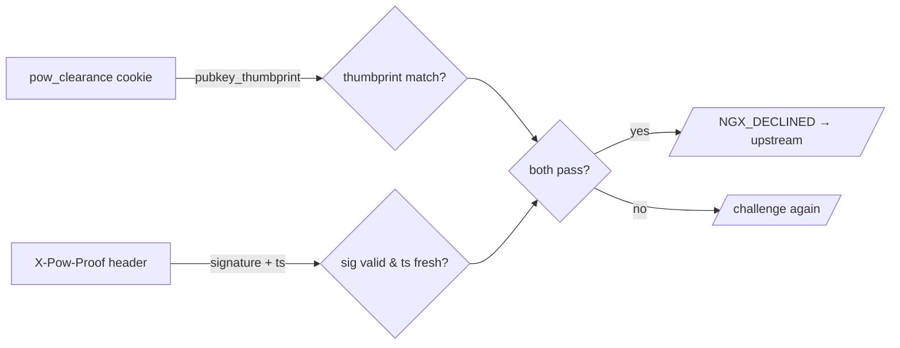

# Protocol reference: the `/.pow/` endpoints

The wire contract between the browser solver and the module. Everything here is
served under `pow_gate_endpoint` (default `/.pow/`). Use this when implementing or
replacing the solver, or debugging the handshake.

- [Endpoints](#endpoints)
- [`GET {endpoint}challenge`](#get-endpointchallenge)
- [`GET {endpoint}solver.js`](#get-endpointsolverjs)
- [`POST {endpoint}verify`](#post-endpointverify)
- [Token formats](#token-formats)
- [The per-request proof](#the-per-request-proof)
- [Full message sequence](#full-message-sequence)
- [Error handling](#error-handling)

> These formats are **implemented and exercised** by the live e2e test: the engine
> (`src/pow-gate-core`) and `assets/solver.js` speak exactly this contract — the
> JSON field names below are the wire format the module emits and accepts.

---

## Endpoints

| Method | Path                  | Purpose                                  | Handler                            |
| ------ | --------------------- | ---------------------------------------- | ---------------------------------- |
| `GET`  | `{endpoint}challenge` | Issue fresh PoW parameters               | `engine::pow::issue_challenge`     |
| `GET`  | `{endpoint}solver.js` | Serve the browser solver                 | `challenge::serve_solver`          |
| `POST` | `{endpoint}verify`    | Submit a solution, receive clearance     | `engine::pow::verify_solution`     |

Routing is in [`src/challenge.rs`](../src/ngx-http-pow-gate/src/challenge.rs) (`route_internal`). These
paths are owned by the module regardless of your `location` blocks.

---

## `GET {endpoint}challenge`

Returns the parameters for one proof-of-work attempt.

**Response** `200 application/json`:

```json
{
  "salt": "b64url-random-bound-to-client",
  "target": "b64url-32-byte-threshold",
  "expires_at": 1718450000
}
```

| Field        | Meaning                                                                       |
| ------------ | ----------------------------------------------------------------------------- |
| `salt`       | Per-request random, **HMAC-bound** so `/verify` can confirm it issued it.      |
| `target`     | 256-bit threshold; a solution must hash strictly below it.                    |
| `expires_at` | Unix seconds. Solutions submitted after this are rejected (anti-precompute).  |

`target` is derived from `pow_gate_difficulty`: `target = 2^256 / difficulty`
(see `engine::pow::difficulty_to_target`). The client does **not** choose
difficulty; it's server-controlled.

The salt being HMAC-bound and short-lived is what stops an attacker from farming
challenges out to a solver pool or precomputing solutions.

---

## `GET {endpoint}solver.js`

Serves [`assets/solver.js`](../assets/solver.js) (embedded in the module via
`include_bytes!`). `200 text/javascript`, cacheable. The challenge page references
it with the difficulty and endpoint as data-attributes:

```html
<script src="{{endpoint}}solver.js"
        data-difficulty="{{difficulty}}"
        data-endpoint="{{endpoint}}" defer></script>
```

The solver reads those attributes, runs the loop, and updates the page's hook
elements (`#pow-status`, `#pow-progress`, `#pow-percent`, `#pow-error`).

---

## `POST {endpoint}verify`

Submits a found nonce plus the client's public key.

**Request** `application/json`:

```json
{
  "salt": "<the salt from /challenge>",
  "nonce": 482193,
  "pubkey": { "kty": "EC", "crv": "P-256", "x": "…", "y": "…" }
}
```

**Server checks (all must pass):**

1. `salt` carries a valid HMAC (we issued it) and `expires_at` is in the future.
2. `SHA-256(salt ‖ nonce) < target`.
3. `pubkey` is a well-formed key of the expected type.

**Response on success** `204 No Content`:

```
Set-Cookie: pow_clearance=<payload>.<tag>; Path=/; Max-Age=43200; SameSite=Lax; Secure; HttpOnly
```

The cookie **name and attributes are configurable** via the `pow_gate_cookie_*`
directives (`name`, `domain`, `path`, `samesite`, `secure`, `httponly`); `Max-Age`
tracks `pow_gate_clearance_ttl`. The line above shows the defaults. See
[configuration.md › Clearance-cookie directives](configuration.md#clearance-cookie-directives)
and [`engine::clearance::build_set_cookie`](../src/ngx-http-pow-gate/src/engine/clearance.rs).

**Response on failure** `400` (bad solution / expired / malformed) — the solver
reveals `#pow-error` and offers a retry.

After a `204`, the solver calls `location.reload()`; the reloaded request carries
the cookie and a fresh per-request proof, and the gate lets it through.

---

## Token formats

### Clearance cookie (default name `pow_clearance`, set via `pow_gate_cookie_name`)

```
<cookie_name> = base64url(payload) "." base64url(HMAC-SHA256(key, payload))
```

`payload` (compact JSON or fixed binary) contains:

| Field               | Purpose                                                       |
| ------------------- | ------------------------------------------------------------- |
| `ip_bucket`         | Coarse client-IP binding (tolerates NAT / mobile changes).    |
| `ua_hash`           | Hash of the User-Agent at issue time.                         |
| `pubkey_thumbprint` | Thumbprint of the client key — links cookie to the proof.     |
| `issued_at`         | Unix seconds.                                                 |
| `expires_at`        | `issued_at + pow_gate_clearance_ttl`.                         |

Verified in [`src/engine/clearance.rs`](../src/ngx-http-pow-gate/src/engine/clearance.rs):
constant-time tag comparison (`subtle`), expiry check, then proof check.

Cookie attributes default to `HttpOnly` (no JS read), `Secure` (HTTPS only),
`SameSite=Lax`, `Path=/`, host-only, `Max-Age` = the clearance TTL — each
overridable with the `pow_gate_cookie_*` directives.

---

## The per-request proof

The cookie proves *work was done*; the proof proves *this is the same client now*.
On every gated request after clearance, the client sends:

```
X-Pow-Proof: base64url( sign_privkey( H( method | path | timestamp ) ) ) . <timestamp>
```

The server ([`src/pow-gate-core/src/proof.rs`](../src/pow-gate-core/src/proof.rs)):

1. Reconstructs `H(method | path | timestamp)` from the request line.
2. Checks `|now − timestamp| ≤ pow_gate_proof_skew`.
3. Verifies the signature against the public key whose thumbprint is in the
   clearance cookie.



This is the [DPoP](https://www.rfc-editor.org/rfc/rfc9449) pattern: a bearer
token (the cookie) bound to proof-of-possession of a private key. Stealing the
cookie is useless without the key; capturing one proof is useless after
`pow_gate_proof_skew` seconds.

---

## Full message sequence

```mermaid
sequenceDiagram
    autonumber
    participant B as Browser (solver.js)
    participant M as nginx + pow_gate
    B->>M: GET /            (no cookie)
    M-->>B: 200 challenge.html
    B->>M: GET /.pow/solver.js
    M-->>B: 200 solver.js
    B->>M: GET /.pow/challenge
    M-->>B: 200 { salt, target, expires_at }
    Note over B: keygen P-256;<br/>nonce: SHA256(salt‖nonce) < target
    B->>M: POST /.pow/verify { salt, nonce, pubkey }
    alt solution valid & unexpired
        M-->>B: 204 Set-Cookie: pow_clearance
        B->>M: GET / (Cookie + X-Pow-Proof)
        M-->>B: 200 upstream content
    else invalid / expired
        M-->>B: 400
        Note over B: show #pow-error, retry from /challenge
    end
```

---

## Error handling

| Condition                              | Response | Client behaviour                         |
| -------------------------------------- | -------- | ---------------------------------------- |
| `/verify` solution wrong/expired       | `400`    | Show `#pow-error`, restart from challenge |
| Clearance cookie HMAC fails            | (no pass)| Re-challenged on the next request         |
| Clearance expired                      | (no pass)| Re-challenged; solver runs again          |
| Proof missing / stale / bad signature  | (no pass)| Re-challenged                             |
| `deny` decision                        | `403`    | No challenge; hard stop                   |
| JS disabled                            | page only| Cannot complete — use `allow`/exclusions  |

Re-challenge is graceful: an expired clearance just sends the next request back
to the challenge page, the solver runs, and the client is cleared again — no hard
error for the user.
