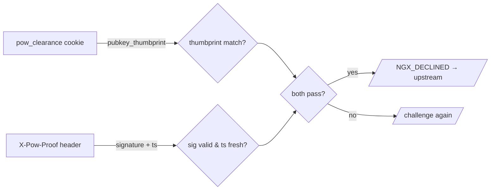

# Protocol reference: the `/.pow/` endpoints

The wire contract between the browser solver and the module. Everything here is
served under `pow_gate_endpoint` (default `/.pow/`). Use this when implementing or
replacing the solver, or debugging the handshake.

- [Endpoints](#endpoints)
- [`GET {endpoint}challenge`](#get-endpointchallenge)
- [`GET {endpoint}solver.js`](#get-endpointsolverjs)
- [`POST {endpoint}verify`](#post-endpointverify)
- [The captured request (`pow-replay`)](#the-captured-request-pow-replay)
- [Token formats](#token-formats)
- [The per-request proof](#the-per-request-proof)
- [Full message sequence](#full-message-sequence)
- [Error handling](#error-handling)

> These formats are **implemented and exercised** by the live e2e test: the engine
> (`src/pow-gate-core`) and `assets/solver.js` speak exactly this contract — the
> JSON field names below are the wire format the module emits and accepts.

---

## Endpoints

| Method | Path                  | Purpose                                  | Handler                            |
| ------ | --------------------- | ---------------------------------------- | ---------------------------------- |
| `GET`  | `{endpoint}challenge` | Issue fresh PoW parameters               | `engine::pow::issue_challenge`     |
| `GET`  | `{endpoint}solver.js` | Serve the browser solver                 | `challenge::serve_solver`          |
| `POST` | `{endpoint}verify`    | Submit a solution, receive clearance     | `engine::pow::verify_solution`     |
| `GET`  | `{endpoint}pass`      | Redeem a no-JS meta-refresh grant        | `engine::nojs::pass`               |

Routing is in [`src/challenge.rs`](../src/ngx-http-pow-gate/src/challenge.rs) (`route_internal`). These
paths are owned by the module regardless of your `location` blocks.

---

## `GET {endpoint}challenge`

Returns the parameters for one proof-of-work attempt.

**Response** `200 application/json`:

```json
{
  "salt": "hex-random-per-request",
  "exp": 1718450000,
  "difficulty": 50000,
  "token": "b64url-hmac-over-salt-exp-difficulty"
}
```

| Field        | Meaning                                                                       |
| ------------ | ----------------------------------------------------------------------------- |
| `salt`       | Per-request random (hex).                                                     |
| `exp`        | Unix seconds. Solutions submitted after this are rejected (anti-precompute).  |
| `difficulty` | Expected hash count for THIS client — the configured value, or the `challenge:<N>`/`challenge:js` decision override. |
| `token`      | HMAC binding `salt`+`exp`+`difficulty` to the server (opaque to the client).  |

The client derives `target = 2^256 / difficulty` itself and searches a nonce
with `SHA-256(salt + nonce) < target`. The client does **not** choose the
difficulty: it echoes it to `/verify`, but the `token` HMAC-binds the exact
value issued — echoing anything else fails verification.

The token being HMAC-bound and short-lived is what stops an attacker from
farming challenges out to a solver pool or precomputing solutions.

---

## `GET {endpoint}solver.js`

Serves [`assets/solver.js`](../assets/solver.js) (embedded in the module via
`include_bytes!`). `200 text/javascript`, cacheable. The challenge page references
it with the difficulty and endpoint as data-attributes:

```html
<script src="{{endpoint}}solver.js"
        data-difficulty="{{difficulty}}"
        data-endpoint="{{endpoint}}" defer></script>
```

The solver reads those attributes, runs the loop, and updates the page's hook
elements (`#pow-status`, `#pow-progress`, `#pow-percent`, `#pow-error`).

---

## `POST {endpoint}verify`

Submits a found nonce plus the client's public key.

**Request** `application/json`:

```json
{
  "salt": "<from /challenge>",
  "exp": 1718450000,
  "token": "<from /challenge>",
  "nonce": 482193,
  "pubkey": "<base64url SEC1 uncompressed P-256 public key>",
  "difficulty": 50000
}
```

`difficulty` is the value echoed from `/challenge`; it is authenticated by
`token`, never trusted on its own. (A body without it verifies against the
configured difficulty — correct whenever no decision override is in play.)

**Server checks (all must pass):**

1. `token` is the HMAC we issued over exactly this `salt`+`exp`+`difficulty`,
   and `exp` is in the future.
2. `SHA-256(salt ‖ nonce) < 2^256 / difficulty`.
3. `pubkey` decodes (base64url).

**Response on success** `204 No Content`:

```
Set-Cookie: pow_clearance=<payload>.<tag>; Path=/; Max-Age=43200; SameSite=Lax; Secure; HttpOnly
```

The cookie **name and attributes are configurable** via the `pow_gate_cookie_*`
directives (`name`, `domain`, `path`, `samesite`, `secure`, `httponly`); `Max-Age`
tracks `pow_gate_clearance_ttl`. The line above shows the defaults. See
[configuration.md › Clearance-cookie directives](configuration.md#clearance-cookie-directives)
and [`engine::clearance::build_set_cookie`](../src/ngx-http-pow-gate/src/engine/clearance.rs).

**Response on failure** `400` (bad solution / expired / malformed) — the solver
reveals `#pow-error` and offers a retry.

After a `204`, the solver calls `location.reload()`; the reloaded request carries
the cookie and a fresh per-request proof, and the gate lets it through.

---

## `GET {endpoint}pass` (no-JS flow)

The redeem endpoint behind `challenge:nojs` decisions. The no-JS challenge page
(`assets/challenge-nojs.html` or `pow_gate_nojs_page`) meta-refreshes to
`{endpoint}pass?t=<grant>` after the configured delay. The grant is
`base64url(JSON{path, iat, delay}) "." base64url(HMAC(key, "nojs|" + payload))`
— domain-separated from the clearance format, one-shot in effect (it expires
`nojs::NOJS_GRACE` = 120 s after issuance).

| Grant state                     | Response                                                     |
| ------------------------------- | ------------------------------------------------------------ |
| authentic, waited ≥ `delay`     | `302` to the original path + clearance `Set-Cookie`          |
| authentic, redeemed too early   | `200` — the no-JS page again with a **fresh** grant (wait restarts) |
| forged / expired / malformed    | `302 /` (falls back into whatever challenge the decision assigns) |

The minted clearance carries an **empty** public key — a no-JS client cannot
sign per-request proofs — so under `pow_gate_require_proof on` its fetch/XHR
requests would be challenged (moot for text browsers). Handlers:
[`engine::nojs::pass`](../src/ngx-http-pow-gate/src/engine/nojs.rs),
[`pow_gate_core::nojs`](../src/pow-gate-core/src/nojs.rs).

---

## The captured request (`pow-replay`)

Not an endpoint — a block the module injects into the challenge page when the
challenged request carried a body (`pow_gate_replay`, default on). It is how a
form `POST` survives a challenge: the request comes back to the client that
sent it, and the solver re-issues it after `/verify` succeeds.

Injected immediately before the page's closing `</body>`:

```html
<script id="pow-replay" type="application/json">
{"method":"POST","url":"/order?ref=mail","type":"application/x-www-form-urlencoded","body":"cXR5PTI"}
</script>
```

| Field    | Type   | Meaning                                                        |
| -------- | ------ | -------------------------------------------------------------- |
| `method` | string | The original method, verbatim (case-sensitive). Any data-carrying verb — `POST`, `PUT`, `PATCH`, `DELETE`, `OPTIONS`, `PROPFIND`, … — but never `GET`/`HEAD`/`TRACE`/`CONNECT` |
| `url`    | string | The original request target, verbatim: an absolute same-site path with its query string, still percent-encoded |
| `type`   | string | The original `Content-Type` (may be empty)                      |
| `body`   | string | The original body, base64url, no padding                        |

Response headers: `Cache-Control: no-store` — the page carries request data.

Client contract (`assets/solver.js`):

1. after the clearance cookie is set, read the block; absent → plain
   `location.reload()`, nothing was captured;
2. `application/x-www-form-urlencoded` + `POST` → rebuild a hidden `<form>` and
   submit it, so the browser owns redirects, history and rendering exactly as it
   would have for the original submit;
3. anything else → `fetch` the raw bytes back with the original `Content-Type`,
   then follow `res.redirected` or write the returned document out.

`<`, `>` and `&` are emitted as `\uXXXX` escapes, so the JSON can never close
its own `<script>` block; `url` is rejected unless it is an absolute same-site
path free of quotes, angle brackets and control bytes. The payload is **not**
signed — it never leaves the client that produced it, and a client that edits it
merely sends a different request of its own, which a cleared client may do
anyway. See [`core/replay.rs`](../src/pow-gate-core/src/replay.rs).

---

## Token formats

### Clearance cookie (default name `pow_clearance`, set via `pow_gate_cookie_name`)

```
<cookie_name> = base64url(payload) "." base64url(HMAC-SHA256(key, payload))
```

`payload` (compact JSON — see [`pow_gate_core::clearance::Clearance`](../src/pow-gate-core/src/clearance.rs)):

| Field | Purpose                                                                  |
| ----- | ------------------------------------------------------------------------ |
| `pk`  | Client public key (base64url SEC1) — binds the cookie to the proof key. Empty for no-JS clearances (they cannot sign proofs). |
| `iat` | Issued-at, unix seconds.                                                 |
| `exp` | `iat + pow_gate_clearance_ttl`.                                          |

Verified in [`src/engine/clearance.rs`](../src/ngx-http-pow-gate/src/engine/clearance.rs):
constant-time tag comparison (`subtle`), expiry check, then proof check.

Cookie attributes default to `HttpOnly` (no JS read), `Secure` (HTTPS only),
`SameSite=Lax`, `Path=/`, host-only, `Max-Age` = the clearance TTL — each
overridable with the `pow_gate_cookie_*` directives.

---

## The per-request proof

The cookie proves *work was done*; the proof proves *this is the same client now*.
On every gated `fetch()` after clearance (the only request kind that can carry a
custom header — see `pow_gate_require_proof` in
[configuration.md](configuration.md)), the client sends:

```
X-Pow-Proof: base64url( sign_privkey( H( method | path | timestamp ) ) ) . <timestamp>
```

The server ([`src/pow-gate-core/src/proof.rs`](../src/pow-gate-core/src/proof.rs)):

1. Reconstructs `H(method | path | timestamp)` from the request line.
2. Checks `|now − timestamp| ≤ pow_gate_proof_skew`.
3. Verifies the signature against the public key whose thumbprint is in the
   clearance cookie.


```mermaid
flowchart LR
    cookie[pow_clearance cookie] -->|pubkey_thumbprint| match{thumbprint match?}
    header[X-Pow-Proof header] -->|signature + ts| sig{sig valid & ts fresh?}
    match --> ok{both pass?}
    sig --> ok
    ok -- yes --> allow[/NGX_DECLINED → upstream/]
    ok -- no --> chal[/challenge again/]
```

This is the [DPoP](https://www.rfc-editor.org/rfc/rfc9449) pattern: a bearer
token (the cookie) bound to proof-of-possession of a private key. Stealing the
cookie is useless without the key; capturing one proof is useless after
`pow_gate_proof_skew` seconds.

---

## Full message sequence

```mermaid
sequenceDiagram
    autonumber
    participant B as Browser (solver.js)
    participant M as nginx + pow_gate
    B->>M: GET /            (no cookie)
    M-->>B: 200 challenge.html
    B->>M: GET /.pow/solver.js
    M-->>B: 200 solver.js
    B->>M: GET /.pow/challenge
    M-->>B: 200 { salt, target, expires_at }
    Note over B: keygen P-256;<br/>nonce: SHA256(salt‖nonce) < target
    B->>M: POST /.pow/verify { salt, nonce, pubkey }
    alt solution valid & unexpired
        M-->>B: 204 Set-Cookie: pow_clearance
        B->>M: GET / (Cookie + X-Pow-Proof)
        M-->>B: 200 upstream content
    else invalid / expired
        M-->>B: 400
        Note over B: show #pow-error, retry from /challenge
    end
```

---

## Error handling

| Condition                              | Response | Client behaviour                         |
| -------------------------------------- | -------- | ---------------------------------------- |
| `/verify` solution wrong/expired       | `400`    | Show `#pow-error`, restart from challenge |
| Clearance cookie HMAC fails            | (no pass)| Re-challenged on the next request         |
| Clearance expired                      | (no pass)| Re-challenged; solver runs again          |
| Clearance expired on a `POST`          | page + `pow-replay` | Solver re-issues the request after clearing |
| Proof missing / stale / bad signature  | (no pass)| Re-challenged                             |
| `deny` decision                        | `403`    | No challenge; hard stop                   |
| JS disabled                            | page only| Cannot complete — use `allow`/exclusions  |

Re-challenge is graceful: an expired clearance just sends the next request back
to the challenge page, the solver runs, and the client is cleared again — no hard
error for the user.
