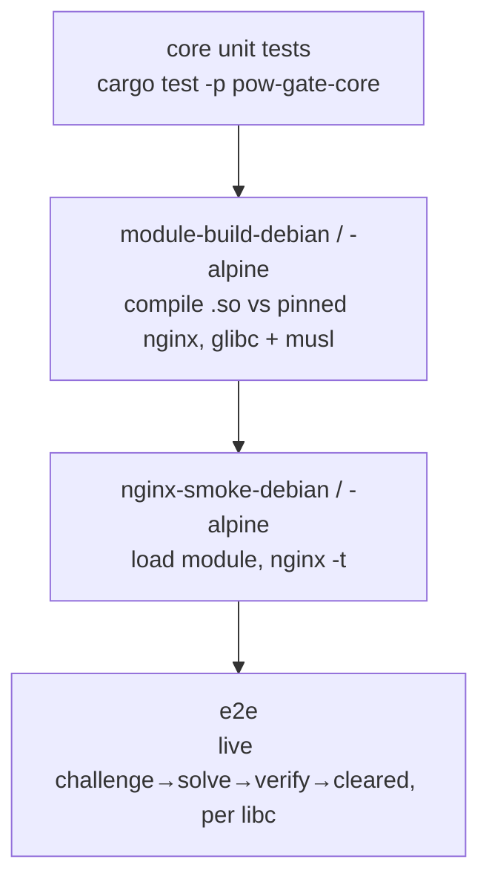

# Testing & self-verification

The project verifies itself at three levels, each runnable on its own. The split
exists because the crypto can be tested anywhere, but the nginx module can only be
built and exercised against a real nginx — so that part runs in Docker.



- [Layout: where tests live](#layout-where-tests-live)
- [1. Core unit tests (no Docker)](#1-core-unit-tests-no-docker)
- [2. Module build (Docker)](#2-module-build-docker)
- [3. nginx smoke (Docker)](#3-nginx-smoke-docker)
- [4. End-to-end (Docker Compose)](#4-end-to-end-docker-compose)
- [One command](#one-command)
- [CI](#ci)
- [What each layer proves](#what-each-layer-proves)

---

## Layout: where tests live

All code lives under a crate's `src/`: the nginx module in
`src/ngx-http-pow-gate/src/`, the engine in `src/pow-gate-core/src/`.
**Tests are their own projects**, never mixed into the source files:

```text
src/pow-gate-core/tests/         integration tests for the engine — one crate per file
                    (target, codec, pow, clearance, proof, ranges), public API only
tests/integration/  the black-box e2e client — a standalone Cargo project that
                    is NOT a workspace member (no nginx dependency)
docker/             Dockerfile (multi-stage pipeline) + nginx.test.conf
docker-compose.test.yml   wires nginx + the e2e client together
scripts/test.sh     runs the whole thing locally
```

---

## 1. Core unit tests (no Docker)

The engine — PoW target math, the challenge handshake, clearance tokens, and the
ECDSA proof — is a pure-Rust crate (`src/pow-gate-core/`) with no nginx
dependency, so it runs on any machine in well under a second:

```bash
cd src/pow-gate-core && cargo test
# or from the repo root:
cargo test -p pow-gate-core
```

These tests pin the wire contract the browser must reproduce (the PoW hash, the
`difficulty → target` math) and prove the security properties: forged/expired/
tampered tokens are rejected, a client can't downgrade difficulty, and stale or
mismatched proofs fail.

---

## 2. Module build (Docker)

Compiles the dynamic module `.so` against a pinned nginx source. This is the step
you can't do without a matching nginx — it proves the FFI shell compiles and is
ABI-bound to that nginx. A dynamic module is libc-specific, so there is one stage
per target:

```bash
docker build -f docker/Dockerfile --target module-build-debian .   # glibc (Debian trixie)
docker build -f docker/Dockerfile --target module-build-alpine .   # musl  (Alpine)
```

Pin `NGINX_VERSION` (build arg) to the nginx you deploy; `--with-compat` gives a
stable module ABI (see [build.md](build.md)).

---

## 3. nginx smoke (Docker)

Loads the freshly built `.so` into the matching `nginx:<version>` image (Debian
or Alpine) and runs `nginx -t` against
[docker/nginx.test.conf](../docker/nginx.test.conf), which exercises **every**
directive. It fails if the module is ABI-incompatible or any directive won't
parse:

```bash
docker build -f docker/Dockerfile --target nginx-smoke-debian .   # glibc
docker build -f docker/Dockerfile --target nginx-smoke-alpine .   # musl
```

---

## 4. End-to-end (Docker Compose)

Brings up nginx with the module, then runs the black-box client
([tests/integration](../tests/integration)) which walks the full handshake —
fetch a challenge, **solve it with `pow-gate-core`**, submit, then make a cleared
request with a **`p256`-signed proof** (the same primitives the browser uses):

```bash
docker compose -f docker-compose.test.yml up --build \
  --abort-on-container-exit --exit-code-from e2e
```

Exit code is the client's, so it gates CI. The client asserts: excluded paths are
never gated, an uncleared request is challenged, `/verify` sets a clearance
cookie, and a cleared request reaches the upstream.

---

## One command

```bash
./scripts/test.sh          # core tests + full Docker pipeline
./scripts/test.sh core     # just the engine tests (fast)
./scripts/test.sh docker   # build + smoke + e2e
```

---

## CI

CI is split across a few workflows:

- [ci.yml](../.github/workflows/ci.yml) — a fast `core` job (engine tests + e2e
  client compiles) and an `e2e` job (the live handshake) as a **matrix of
  `{libc × arch}`** (`debian`→glibc, `alpine`→musl, on `amd64` and `arm64`).
- [module-amd64.yml](../.github/workflows/module-amd64.yml) /
  [module-arm64.yml](../.github/workflows/module-arm64.yml) — build the `.so` +
  `nginx -t` for both libc on each architecture. Split per arch so each carries
  its own status badge (native arm runners, no QEMU; digest-pinned multi-arch
  base images resolve to the runner's arch).
- [release.yml](../.github/workflows/release.yml) — on a tag: reproducible double
  build + provenance + cosign + checksums for all four `{libc × arch}` `.so`s; see
  [build.md](build.md#verifiable-builds).

---

## What each layer proves

| Layer        | Proves                                                              | Needs   |
| ------------ | ------------------------------------------------------------------ | ------- |
| core tests   | the crypto/protocol is correct and the wire contract is pinned     | Rust    |
| module-build-{debian,alpine} | the FFI shell compiles + is ABI-bound to nginx, on glibc and musl | Docker  |
| nginx-smoke-{debian,alpine}  | the module loads and every directive parses, on both libc          | Docker  |
| e2e          | the live request flow works end to end against real nginx (per libc) | Docker  |

> Status (verified): **all four layers are green, nothing left as scaffold.** The
> engine is unit-tested, the module compiles against nginx 1.31.1, loads
> (`nginx -t`), and passes the full live handshake — an uncleared request is
> challenged, the client solves the PoW with `pow-gate-core`, `POST /verify`
> returns a clearance cookie, and a cleared request (cookie + `X-Pow-Proof`)
> reaches the upstream. The e2e also exercises the **good-bot verifier**: a
> `verify:<name>` UA is allowed via a live IP-range feed the refresher fetched.
